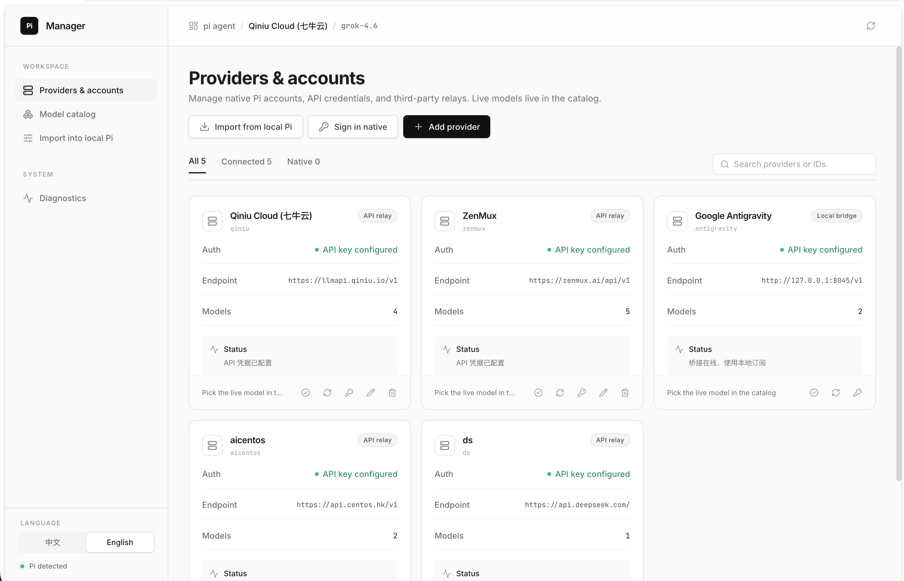

<div align="center">

# 🥧 Pi Manager

**A local, visual control plane for [Pi coding agent](https://github.com/badlogic/pi-mono).**

Manage OpenAI-compatible relays, native subscriptions, custom model catalogs, and Thinking parameters with ease. Non-invasive, safe, and backed up before every write to `~/.pi/agent`.

[](https://www.npmjs.com/package/@wax0629/pi-manager)
[](LICENSE)
[](https://github.com/earendil-works/pi/discussions/9427)
[](#中文说明)

<br/>



</div>

<br/>

[English](#english) | [中文说明](#中文说明)

---

## English

### Quick Start

Run instantly without cloning or local setup:

```bash
npx @wax0629/pi-manager
```

Or install globally:

```bash
npm i -g @wax0629/pi-manager
pi-manager
```

> **Requirements**: Node.js 20+ and official `pi` installed on your `PATH`.

Opens `http://127.0.0.1:8670` in your default browser. If port `8670` is already in use, it safely focuses the existing instance.

---

### Key Features

- **📡 Provider & Account Management**
  - Connect third-party OpenAI-compatible relays or local bridges (e.g., Antigravity on `127.0.0.1:8045/v1`).
  - Auto-discover upstream models via `/models` with one-click selection.
  - Native Pi provider sign-in directly via official OAuth and API key flows.
  - Granular import from your existing `~/.pi/agent/models.json` with checkbox selection.

- **📦 Model Catalog & Reasoning Control**
  - Full catalog viewing and editing.
  - Configure the model cycle list (`Ctrl+P` in Pi).
  - Fine-tune custom Context Window sizes and **Thinking / Reasoning levels** (`low`, `medium`, `high`, `xhigh`, `max`).

- **🛡️ Safe Live Sync & Instant Rollback**
  - Merges candidate configurations into `~/.pi/agent` (`settings.json`, `models.json`, `auth.json`).
  - Automatically takes a timestamped backup before every apply.
  - One-click rollback if something goes wrong.

- **🌐 Native Bilingual Experience**
  - Clean UI following Vercel / Geist design principles with automatic Dark/Light mode support.
  - Auto-detects browser locale (English by default for international users, Chinese for `zh*`), with an instant toggle in the sidebar.

---

### Core Philosophy

1. **Non-invasive**: Does **not** fork Pi, does **not** monkey-patch internals, and **never** touches your project's local `.pi` directory.
2. **Safe Secrets**: Plaintext API keys and OAuth refresh tokens are never copied into Manager state or echoed in UI/logs.
3. **True Upstream**: You use official `pi` CLI at all times. After importing into `~/.pi/agent`, simply restart your active `pi` session to load the updated models.

---

### Data Storage

| Location | Purpose |
| --- | --- |
| `~/.pi-manager/` | Manager local state, encrypted key vault, backup snapshots |
| `~/.pi/agent/` | Official Pi agent settings, models, and auth read by CLI |

---

## 中文说明

### 快速开始

无需克隆仓库，直接运行：

```bash
npx @wax0629/pi-manager
```

或全局安装：

```bash
npm i -g @wax0629/pi-manager
pi-manager
```

> **运行要求**：Node.js 20+，且本机已安装官方 `pi`（命令行可在 `PATH` 中找到）。

命令会自动启动本地服务 `http://127.0.0.1:8670` 并打开浏览器。端口被占用时自动复用已有实例。

---

### 核心功能

- **📡 供应商与账号管理**
  - 支持添加任意 OpenAI 兼容中转及本地桥接（如 Antigravity `127.0.0.1:8045/v1`）。
  - 支持新增供应商时自动请求上游 `/models` 获取可用模型列表，按需勾选录入。
  - 支持从本机 Pi 原有配置中多选导入渠道。
  - 支持官方原生渠道登录（OAuth / API Key）。

- **📦 模型资源库与思考深度控制**
  - 维护完整候选模型目录与 Context 窗口长度。
  - ���定义 Pi 终端内的快速循环切换列表（`Ctrl+P`）。
  - 精细配置每个模型的 **Thinking 等级映射**（`low` / `medium` / `high` / `xhigh` / `max`）。

- **🛡️ 安全合并与一键回滚**
  - 将配置合并写入本机 `~/.pi/agent`（`settings.json`、`models.json`、`auth.json`）。
  - 每次导入前自动为当前配置生成时间戳备份。
  - 如发现不符合预期，随时在界面内一键回滚到上一备份版本。

- **🌐 中英双语与优雅界面**
  - 基于 Geist 极简设计规范，完美支持深色/浅色自适应模式。
  - 界面随系统/浏览器语言自适应，侧栏支持实时一键切换中英文。

---

### 设计原则

1. **零侵入**：不 fork Pi、不改动 Pi 源码，绝不污染项目目录下的 `.pi`。
2. **凭据安全**：密钥与 Token 绝不明文存入 Manager 状态文件，界面不回显明文。
3. **原生兼容**：导入后使用的是系统原汁原味的 `pi` 命令。导完退出重启 Pi 终端即完成生效。

---

## 社区与交流 (Community)

- **GitHub Discussions**: [earendil-works/pi/discussions/9427](https://github.com/earendil-works/pi/discussions/9427)
- **Discord**: [Pi Official Discord](https://discord.com/invite/3cU7Bz4UPx)

## License

[MIT](LICENSE)
